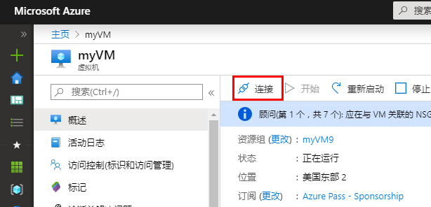
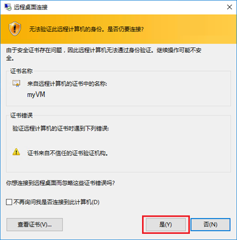
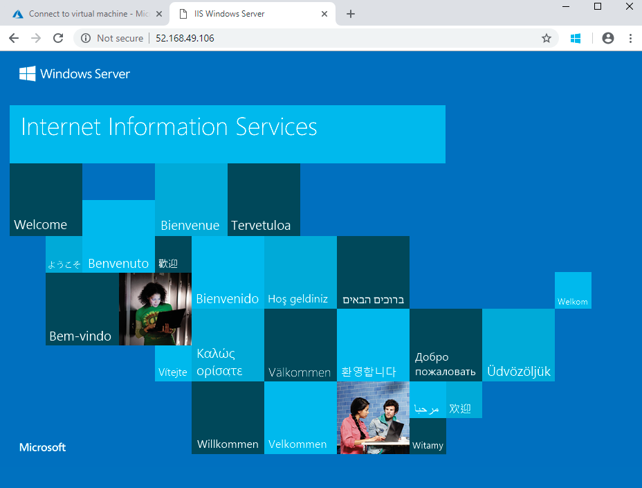

---
wts:
  title: 01 - 在门户中创建虚拟机（10 分钟）
  module: Module 02 - Core Azure Services (Workloads)
---
# <a name="01---create-a-virtual-machine-in-the-portal-10-min"></a>01 - 在门户中创建虚拟机（10 分钟）

在本演练中，我们将在 Azure 门户中创建一个虚拟机，连接到该虚拟机，安装 Web 服务器角色并进行测试。 

**注意**：请在本演练中花些时间单击并阅读信息图标。 

# <a name="task-1-create-the-virtual-machine"></a>任务 1：创建虚拟机 
1. 登录到 Azure 门户： https://portal.azure.com

3. 从门户菜单的“所有服务”边栏选项卡中，搜索并选择“虚拟机”，然后单击“+ 创建”并从下拉列表中选择“+ Azure 虚拟机”   。

4. 在“基本”选项卡上，填写以下信息（其他所有设置保留默认值）：

    | 设置 | 值 |
    |  -- | -- |
    | 订阅 | 使用提供的默认值 |
    | 资源组 | **新建资源组** |
    | 虚拟机名称 | **myVM** |
    | 区域 | **（美国）美国东部**|
    | 可用性选项 | 没有所需的基础结构冗余选项|
    | 映像 | Windows Server 2019 Datacenter - Gen2|
    | 大小 | Standard D2s v3|
    | 管理员帐户用户名 | **azureuser** |
    | 管理员帐号密码（请小心输入！） | **Pa$$w0rd1234**|
    | 入站端口规则 - | 允许选择端口****|
    | 选择入站端口 | RDP (3389) 和 HTTP (80) | 

5. 切换到“网络”选项卡，确保在“选择入站端口”部分中选中“HTTP (80) 和 RDP (3389)” 。

6. 切换到“管理”选项卡，然后在其“监视”部分中选择以下设置：

    | 设置 | 值 |
    | -- | -- |
    | 启动诊断 | **禁用**|

7. 其余值保留默认值，然后单击页面底部的“查看 + 创建”按钮。

8. Once Validation is passed click the <bpt id="p1">**</bpt>Create<ept id="p1">**</ept> button. It can take anywhere from five to seven minutes to deploy the virtual machine.

9. 你将在部署页面和通过“通知”区域（顶部菜单栏的钟形图标）收到更新。

# <a name="task-2-connect-to-the-virtual-machine"></a>任务 2：连接到虚拟机

在此任务中，我们将使用 RDP（远程桌面协议）连接到新虚拟机。 

1. 单击上方蓝色工具栏中的钟形图标，并在部署成功后选择“转到资源”。 

    **注意**：你也可以使用“部署”页中的“转到资源”链接。 

2. 在虚拟机“概述”边栏选项卡上，单击“连接”按钮并选择下拉列表中的“RDP”  。

    

    <bpt id="p1">**</bpt>Note<ept id="p1">**</ept>: The following directions tell you how to connect to your VM from a Windows computer. On a Mac, you need an RDP client such as this Remote Desktop Client from the Mac App Store and on a Linux computer you can use an open source RDP client.

2. On the <bpt id="p1">**</bpt>Connect to virtual machine<ept id="p1">**</ept> page, keep the default options to connect with the public IP address over port 3389 and click <bpt id="p2">**</bpt>Download RDP File<ept id="p2">**</ept>. A file will download on the bottom left of your screen.

3. 打开下载的 RDP 文件（位于实验室计算机的左下角）并在出现提示时单击“连接” 。 

    

4. 在“Windows 安全中心”窗口中，使用创建 VM azureuser 时使用的管理员凭据和密码 Pa$$w0rd1234 登录  。 

5. You may receive a warning certificate during the sign-in process. Click <bpt id="p1">**</bpt>Yes<ept id="p1">**</ept> or to create the connection and connect to your deployed VM. You should connect successfully.

    

A new Virtual Machine (myVM) will launch inside your Lab. Close the Server Manager and dashboard windows that pop up (click "x" at top right). You should see the blue background of your virtual machine. <bpt id="p1">**</bpt>Congratulations!<ept id="p1">**</ept> You have deployed and connected to a Virtual Machine running Windows Server. 

# <a name="task-3-install-the-web-server-role-and-test"></a>任务 3：安装 Web 服务器角色并进行测试

在此任务中，我们将在刚创建的虚拟机中的服务器上安装 Web 服务器角色，并确保可以显示默认的 IIS 欢迎页面。 

1. 在新打开的虚拟机的搜索栏中，搜索 PowerShell 以启动 PowerShell，找到后依次右键单击“Windows PowerShell”和“以管理员身份运行”  。

    

2. In PowerShell, install the <bpt id="p1">**</bpt>Web-Server<ept id="p1">**</ept> feature on the virtual machine by running the following command. (Paste in the command and hit ENTER for the installment to begin).

    ```PowerShell
    Install-WindowsFeature -name Web-Server -IncludeManagementTools
    ```
  
3. When completed, a prompt will state <bpt id="p1">**</bpt>Success<ept id="p1">**</ept> with a value <bpt id="p2">**</bpt>True<ept id="p2">**</ept>. You do not need to restart the virtual machine to complete the installation. Close the RDP connection to the VM by clicking the <bpt id="p1">**</bpt>x<ept id="p1">**</ept> on the blue bar at the top center of your virtual machine. You can also minimize it by clicking the <bpt id="p1">**</bpt><ph id="ph1">-</ph><ept id="p1">**</ept> on the blue bar at the top center.

    

4. 返回门户，导航回 myVM 的“概述”边栏选项卡，然后使用“单击复制到剪贴板”按钮复制 myVM 的公共 IP 地址，打开新的浏览器选项卡，将该公共 IP 地址粘贴到 URL 文本框中，然后按 Enter 键以浏览到它  。

    

5. 随即将显示默认的 IIS Web 服务器欢迎页面。

    

<bpt id="p1">**</bpt>Congratulations!<ept id="p1">**</ept> You have created a new VM running a web server that is accessible via its public IP address. If you had a web application to host, you could deploy application files to the virtual machine and host them for public access on the deployed virtual machine.


<bpt id="p1">**</bpt>Note<ept id="p1">**</ept>: To avoid additional costs, you can optionally remove this resource group. Search for resource groups, click your resource group, and then click <bpt id="p1">**</bpt>Delete resource group<ept id="p1">**</ept>. Verify the name of the resource group and then click <bpt id="p1">**</bpt>Delete<ept id="p1">**</ept>. Monitor the <bpt id="p1">**</bpt>Notifications<ept id="p1">**</ept> to see verify that the deletion completed successfully. 
