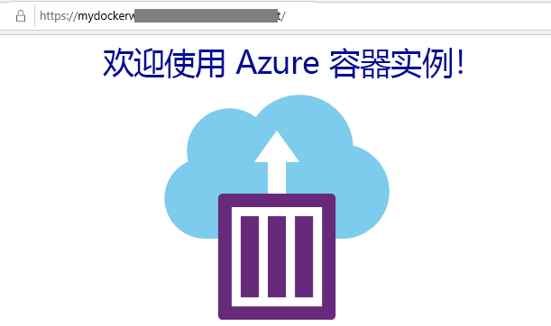

---
wts:
  title: 02 - 创建 Web 应用（10 分钟）
  module: Module 02 - Core Azure Services (Workloads)
---
# 02 - 创建 Web 应用（10 分钟）

In this walkthrough, we will create a web app that runs a Docker container. The Docker container contains a Welcome message. 

Azure App Service are actually a collection of four services, all of which are built to help you host and run web applications. The four services (Web Apps, Mobile Apps, API Apps, and Logic Apps) look different, but in the end they all operate in very similar ways. Web Apps are the most commonly used of the four services, and this is the service that we will be using in this lab.

# 任务 1：创建 Web 应用 

在此任务中，你将创建一个 Azure 应用服务 Web 应用。 

1. 登录到 [Azure 门户](http://portal.azure.com/)。 

2. 在“所有服务”边栏选项卡上，搜索并选择“应用服务”，然后单击“+ 添加、+ 创建、+ 新建”  

3. On the <bpt id="p1">**</bpt>Basics<ept id="p1">**</ept> tab of the <bpt id="p2">**</bpt>Web App<ept id="p2">**</ept> blade, specify the following settings (replace <bpt id="p3">**</bpt>xxxx<ept id="p3">**</ept> in the name of the web app with letters and digits such that the name is globally unique). Leave the defaults for everything else, including the App Service Plan. 

    | 设置 | 值 |
    | -- | -- |
    | 订阅 | 使用提供的默认值 |
    | 资源组 | **新建资源组**|
    | 名称 | myDockerWebAppxxxx |
    | 发布 | Docker 容器 |
    | 操作系统 | **Linux** |
    | 区域 | **美国东部** |
    
    **注意：** 请记得更改 xxxx，确保 Web 应用名称是唯一的。

4. 单击“下一步”>“Docker”，并配置容器信息。  

    | 设置 | 值 |
    | -- | -- |
    | 选项 | 单个容器 |
    | 映像源 | **Docker 中心** |
    | 访问类型 | **Public** |
    | 映像和标记 | mcr.microsoft.com/azuredocs/aci-helloworld |
    
 **注意：** 启动命令是可选项，在本练习中不需要。

5. 单击“查看 + 创建”，然后单击“创建” 。 

# 任务 2：测试 Web 应用

在此任务中，我们将测试 Web 应用。

1. 等待 Web 应用进行部署。

2. 从“通知”中单击“前往资源” 。 

3. 在本演练中，我们将创建一个运行 Docker 容器的 Web 应用。

    

4. In a new browser window, paste the URl and press enter. The Welcome to Azure Container Instances! welcome message will be displayed.

    

5. Azure 应用服务实际上是四种服务的集合，所有这些服务都旨在帮助你托管和运行 Web 应用程序。 

这四种服务（Web 应用、移动应用、API 应用和逻辑应用）看起来有所不同，但最终都以非常类似的方式运行。

恭喜，你成功创建了一个 Azure 应用服务。
