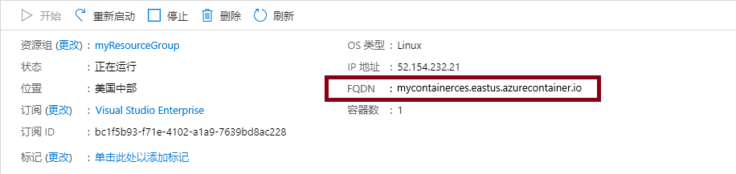
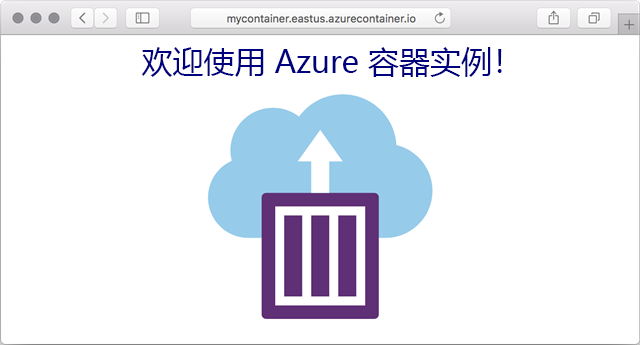

---
wts:
  title: 03 - 部署 Azure 容器实例（10 分钟）
  module: Module 02 - Core Azure Services (Workloads)
---

# 03 - 部署 Azure 容器实例（10 分钟）

In this walkthrough we create, configure, and deploy a container by using Azure Container Instances (ACI) in the Azure Portal. The container is a Welcome to ACI web application that displays a static HTML page. 

# 任务 1：创建容器实例 

在此任务中，我们将为 Web 应用程序创建一个新容器实例。  

1. 登录 [Azure 门户](https://portal.azure.com)。

2. 从“所有服务”边栏选项卡，搜索并选择“容器实例”，然后单击“+ 添加、+ 创建、+ 新建”  。 

3. 为新容器实例提供以下“基本”详细信息（其他所有设置保留默认值）： 

    | 设置| 值|
    |----|----|
    | 订阅 | 使用提供的默认值 |
    | 资源组 | **新建资源组** |
    | 容器名称| mycontainer|
    | 区域 | **（美国）美国东部** |
    | 映像源| **Docker Hub 或其他注册表**|
    | 映像类型| **Public**|
    | 映像| mcr.microsoft.com/azuredocs/aci-helloworld|
    | OS 类型| **Linux** |
    | 大小| 保留默认值|

4. Configure the Networking tab (replace <bpt id="p1">**</bpt>xxxxx<ept id="p1">**</ept> with letters and digits such that the name is globally unique). Leave all other settings at their default values.

    | 设置| Value|
    |--|--|
    | DNS 名称标签| mycontainerdnsxxxxx |

    
    <bpt id="p1">**</bpt>Note<ept id="p1">**</ept>: Your container will be publicly reachable at dns-name-label.region.azurecontainer.io. If you receive a <bpt id="p1">**</bpt>DNS name label not available<ept id="p1">**</ept> error message following the deployment, specify a different DNS name label (replacing the xxxxx) and re-deploy. 

5. 单击“查看和创建”以启动自动验证流程。

6. 单击“创建”以创建容器实例。 

7. 监视部署页面和“通知”页面。 

# 任务 2：验证容器实例的部署

在此任务中，我们通过确保显示欢迎页面来验证容器实例正在运行。

1. 部署完成后，单击部署边栏选项卡上的“前往资源”链接或“通知”区域中的资源链接。

2. 在 mycontainer 的“概述”边栏选项卡，确保容器的“状态”为“正在运行”   。 

3. 找到完全限定的域名 (FQDN)。

    

2. 在本演练中，我们将在 Azure 门户中使用 Azure 容器实例 (ACI) 创建、配置和部署容器。 

    

该容器是显示静态 HTML 页面的“欢迎使用 ACI”Web 应用程序。

<bpt id="p1">**</bpt>Note<ept id="p1">**</ept>: To avoid additional costs, you can optionally remove this resource group. Search for resource groups, click your resource group, and then click <bpt id="p1">**</bpt>Delete resource group<ept id="p1">**</ept>. Verify the name of the resource group and then click <bpt id="p1">**</bpt>Delete<ept id="p1">**</ept>. Monitor the <bpt id="p1">**</bpt>Notifications<ept id="p1">**</ept> to see how the delete is proceeding.
