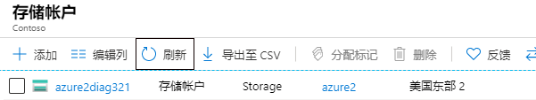
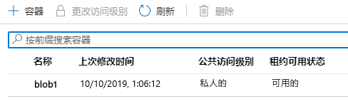

---
wts:
  title: 05 - 创建 blob 存储（5 分钟）
  module: Module 02 - Core Azure Services (Workloads)
---
# 05 - 创建 blob 存储（5 分钟）

在本演练中，我们将创建一个存储帐户，然后使用 Blob 存储文件。

# 任务 1：创建存储帐户 

在此任务中，我们将创建一个新存储帐户。 

1. 通过 <a href="https://portal.azure.com" target="_blank">https://portal.azure.com</a> 登录到 Azure 门户

2. 从“所有服务”边栏选项卡，搜索并选择“存储帐户”，然后单击“+ 添加、+ 创建、+ 新建”  。 

3. On the <bpt id="p1">**</bpt>Basics<ept id="p1">**</ept> tab of the <bpt id="p2">**</bpt>Create storage account<ept id="p2">**</ept> blade, fill in the following information (replace <bpt id="p3">**</bpt>xxxx<ept id="p3">**</ept> in the name of the storage account with letters and digits such that the name is globally unique). Leave the defaults for everything else.

    | 设置 | 值 | 
    | --- | --- |
    | 订阅 | 保留提供的默认值 |
    | 资源组 | **新建资源组** |
    | 存储帐户名称 | storageaccountxxxxx |
    | 位置 | **（美国）美国东部**  |
    | 性能 | **标准** |
    | 冗余 | **本地冗余存储 (LRS)** |
    
    注意 - 请记得更改 xxxxx 以使其成为唯一的存储帐户名

5. 单击“查看 + 创建”查看存储帐户设置并允许 Azure 验证配置。 

6. Once validated, click <bpt id="p1">**</bpt>Create<ept id="p1">**</ept>. Wait for the notification that the account was successfully created. 

7. 从主页，搜索并选择“存储帐户”，并确保已列出你的新存储帐户。

    

# 任务 2：使用 Blob 存储

在此任务中，我们将创建一个 Blob 容器并上传一个 Blob 文件。 

1. 单击新存储帐户的名称，滚动到左侧菜单中的“数据存储”部分，然后单击“容器” 。

2. Click <bpt id="p1">**</bpt>+ Container<ept id="p1">**</ept> and complete the information. Use the Information icons to learn more. When done click <bpt id="p1">**</bpt>Create<ept id="p1">**</ept>.

    | 设置 | 值 |
    | --- | --- |
    | 名称 | **container1**  |
    | 公共访问级别| **专用（不允许匿名访问）** |
  

    

4. Open a new browser window and search <bpt id="p1">**</bpt>Bing<ept id="p1">**</ept> for an image of a flower. Right click on the image and save it to your VM. 

6. 返回门户，单击 container1，然后选择“上传” 。

5. Browse for the image file you just saved on your local computer. Select it and then select upload.

   
6. 单击“高级”箭头，保留默认值，但请查看可用的选项，然后单击“上传” 。

    <bpt id="p1">**</bpt>Note<ept id="p1">**</ept>: You can upload as many blobs as you like in this way. New blobs will be listed within the container.

7. 上传文件后，右键单击该文件，注意“查看/编辑”、“下载”、“属性”和“删除”等选项。 

8. 如果有时间，请查看“文件”、“表”和“队列”的选项。

# 任务 3：监视存储帐户

1. 返回到存储帐户边栏选项卡，然后单击“诊断并解决问题”。 

2. Explore some of the most common storage problems. Notice there are multiple troubleshooters here.

3. On the storage account blade, scroll down to the <bpt id="p1">**</bpt>Monitoring<ept id="p1">**</ept> section and click <bpt id="p2">**</bpt>Insights<ept id="p2">**</ept>. Notice there is information on Failures, Performance, Availability, and Capacity. Your information will be different.

    

在“创建存储帐户”边栏选项卡的“基本”选项卡上，填写以下信息（将存储帐户名称中的“xxxx”替换为字母和数字，使得该名称在全局范围内唯一）。

所有其他设置均保留默认值。
