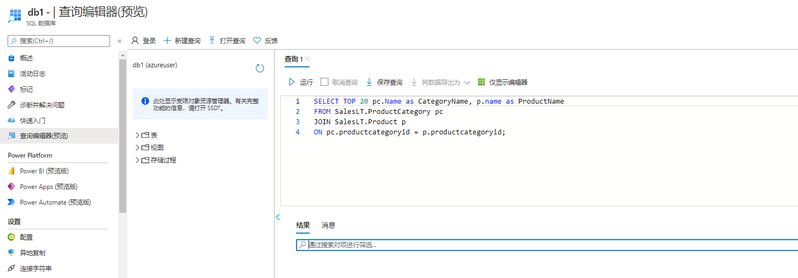

---
wts:
  title: 06 - 创建 SQL 数据库（5 分钟）
  module: Module 02 - Core Azure Services (Workloads)
---

# <a name="06---create-a-sql-database-5-min"></a>06 - 创建 SQL 数据库（5 分钟）

在本演练中，我们将在 Azure 中创建一个 SQL 数据库，然后查询该数据库中的数据。

# <a name="task-1-create-the-database"></a>任务 1：创建数据库 

在此任务中，我们将基于“AdventureWorksLT”示例数据库创建 SQL 数据库。 

1. 通过 [ **https://portal.azure.com** ](https://portal.azure.com) 登录到 Azure 门户。

2. 从“所有服务”边栏选项卡，搜索并选择“SQL 数据库”，然后单击“+ 添加、+ 创建、+ 新建”  。 

3. 在“基本”选项卡上，填写此信息。  

    | 设置 | 值 | 
    | --- | --- |
    | 订阅 | 使用提供的默认值 |
    | 资源组 | **新建资源组** |
    | 数据库名称| **db1** | 
    | 服务器 | 选择“新建”（右侧会打开一个新的侧边栏）|
    | 服务器名称 | **sqlserverxxxx**（必须是唯一的） | 
    | 位置 | **（美国）美国东部** |
    | 身份验证方法 | 使用 SQL 身份验证 |
    | 服务器管理员登录名 | **sqluser** |
    | Password | **Pa$$w0rd1234** |
    | 单击  | **正常** |

   

4. 在“网络”选项卡，配置以下设置（其他设置保留为默认值） 

    | 设置 | 值 | 
    | --- | --- |
    | 连接方法 | **公共终结点** |    
    | 允许 Azure 服务和资源访问此服务器 | **是** |
    | 添加当前客户端 IP 地址 | 否 |
    
   

5. 在“安全”选项卡上。 

    | 设置 | Value | 
    | --- | --- |
    | Microsoft Defender for SQL| 以后再说 |
    
6. 前往“其他设置”选项卡。我们将使用 AdventureWorksLT 示例数据库。

    | 设置 | 值 | 
    | --- | --- |
    | 使用现有数据 | **示例** |

    

7. Click <bpt id="p1">**</bpt>Review + create<ept id="p1">**</ept> and then click <bpt id="p2">**</bpt>Create<ept id="p2">**</ept> to deploy and provision the resource group, server, and database. It can take approx. 2 to 5 minutes to deploy.


# <a name="task-2-test-the-database"></a>任务 2：测试数据库。

在此任务中，我们将配置 SQL server 并运行 SQL 查询。 

1. When the deployment has completed, click Go to resource from the deployment blade. Alternatively, from the <bpt id="p1">**</bpt>All Resources<ept id="p1">**</ept> blade, search and select <bpt id="p2">**</bpt>Databases<ept id="p2">**</ept>, then <bpt id="p3">**</bpt>SQL databases<ept id="p3">**</ept> ensure your new database was created. You may need to <bpt id="p1">**</bpt>Refresh<ept id="p1">**</ept> the page.

    

2. Click the <bpt id="p1">**</bpt>db1<ept id="p1">**</ept> entry representing the SQL database you created. On the db1 blade click <bpt id="p1">**</bpt>Query editor (preview)<ept id="p1">**</ept>.

3. 以 sqluser 身份登录并输入密码“Pa$$w0rd1234”。

4. You will not be able to login. Read the error closely and make note of the IP address that needs to be allowed through the firewall. 

    

5. 返回 db1 边栏选项卡，单击“概述” 。 

    

6. 从 db1“概述”边栏选项卡中，单击概述屏幕顶部中央的“设置服务器防火墙” 。

7. Click <bpt id="p1">**</bpt>+ Add client IP<ept id="p1">**</ept> (top menu bar) to add the IP address referenced in the error. (it may have autofilled for you - if not paste it into the IP address fields). Be sure to <bpt id="p1">**</bpt>Save<ept id="p1">**</ept> your changes. 

    

8. Return to your SQL database (slide the bottom toggle bar to the left) and click on <bpt id="p1">**</bpt>Query Editor (Preview)<ept id="p1">**</ept>. Try to login again as <bpt id="p1">**</bpt>sqluser<ept id="p1">**</ept> with the password <bpt id="p2">**</bpt>Pa$$w0rd1234<ept id="p2">**</ept>. This time you should succeed. Note that it may take a couple of minutes for the new firewall rule to be deployed. 

9. Once you log in successfully, the query pane appears. Enter the following query into the editor pane. 

    ```SQL
    SELECT TOP 20 pc.Name as CategoryName, p.name as ProductName
    FROM SalesLT.ProductCategory pc
    JOIN SalesLT.Product p
    ON pc.productcategoryid = p.productcategoryid;
    ```

    

10. Click <bpt id="p1">**</bpt>Run<ept id="p1">**</ept>, and then review the query results in the <bpt id="p2">**</bpt>Results<ept id="p2">**</ept> pane. The query should run successfully.

    

Congratulations! You have created a SQL database in Azure and successfully queried the data in that database.

<bpt id="p1">**</bpt>Note<ept id="p1">**</ept>: To avoid additional costs, you can optionally remove this resource group. Search for resource groups, click your resource group, and then click <bpt id="p1">**</bpt>Delete resource group<ept id="p1">**</ept>. Verify the name of the resource group and then click <bpt id="p1">**</bpt>Delete<ept id="p1">**</ept>. Monitor the <bpt id="p1">**</bpt>Notifications<ept id="p1">**</ept> to see how the delete is proceeding.
