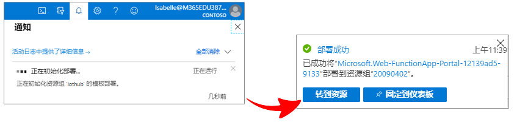

---
wts:
  title: 07 - 实现 Azure IoT 中心（10 分钟）
  module: 'Module 03: Describe core solutions and management tools'
---
# 07 - 实现 Azure IoT 中心（10 分钟）

In this walkthrough, we will configure a new Azure IoT Hub in Azure Portal, and then authenticate a connection to an IoT device using the online Raspberry Pi device simulator. Sensor data and messages are passed from the Raspberry Pi simulator to your Azure IoT Hub, and you view metrics for the messaging activity in Azure Portal.

# 任务 1：创建 IoT 中心 

在此任务中，我们将创建一个 IoT 中心。 

1. 登录 [Azure 门户](https://portal.azure.com)。

2. 从“所有服务”边栏选项卡，搜索并选择“IoT 中心”，然后单击“+ 添加、+ 创建、+ 新建”  。

3. 在“IoT 中心”边栏选项卡的“基本信息”选项卡上，在字段中填写以下详细信息（将存储帐户名称中的 xxxx 替换为字母和数字，使该名称在全局范围内唯一）：

    | 设置 | 值 |
    |--|--|
    | 订阅 | 保留提供的默认值 |
    | 资源组 | **新建资源组** |
    | IoT 中心名称 | my-hub-groupxxxxx |
    | 区域 | **美国东部** |

    注意 - 请记得更改 xxxxx 以使其成为唯一的 IoT 中心名称。

4. 转到“管理”选项卡，使用下拉列表将“定价和规模层”设置为“S1:   **标准层”** 。

5. 单击“审阅 + 创建”按钮。

6. 单击“创建”按钮开始创建新的 Azure IoT 中心实例。

7. 等待 Azure IoT 中心实例部署完成。 

# 任务 2：添加 IoT 设备

在此任务中，我们将 IoT 设备添加到 IoT 中心。 

1. When the deployment has completed, click <bpt id="p1">**</bpt>Go to resource<ept id="p1">**</ept> from the deployment blade. Alternatively, from the <bpt id="p1">**</bpt>All services<ept id="p1">**</ept> blade, search for and select <bpt id="p2">**</bpt>IoT Hub<ept id="p2">**</ept> and locate your new IoT Hub instance

    

2. To add a new IoT device, scroll down to the <bpt id="p1">**</bpt>Device management<ept id="p1">**</ept> section and click <bpt id="p2">**</bpt>Devices<ept id="p2">**</ept>. Then, click <bpt id="p1">**</bpt>+ Add Device<ept id="p1">**</ept>.

    

3. 传感器数据和消息从 Raspberry Pi 模拟器传递到 Azure IoT 中心，你可以在 Azure 门户中查看消息传送活动的指标。

4. 如果看不到新设备，请“刷新”IoT 设备页面。 

5. Select <bpt id="p1">**</bpt>myRaspberryPi<ept id="p1">**</ept> and copy the <bpt id="p2">**</bpt>Primary Connection String<ept id="p2">**</ept> value. You will use this key in the next task to authenticate a connection to the Raspberry Pi simulator.

    

# 任务 3：使用 Raspberry Pi 模拟器测试设备

在此任务中，我们将使用 Raspberry Pi 模拟器测试设备。 

1. Open a new tab in the web browser and type this shortcut link <ph id="ph1">https://aka.ms/RaspPi</ph>. It will take you to a Raspberry Pi Simulator site. If you have time, read about the Raspberry Pi simulator. When done select "<bpt id="p1">**</bpt>X<ept id="p1">**</ept>" to close the pop-up window.

2. In the code area on the right side, locate the line with 'const connectionString ='. Replace it with the connection string you copied from the Azure portal. Note that the connection sting includes the DeviceId (<bpt id="p1">**</bpt>myRaspberryPi<ept id="p1">**</ept>) and SharedAccessKey entries.

    

3. Click <bpt id="p1">**</bpt>Run<ept id="p1">**</ept> (below the code area) to run the application. The console output should show the sensor data and messages that are sent from the Raspberry Pi simulator to your Azure IoT Hub. Data and messages are sent each time the Raspberry Pi simulator LED flashes. 

    

5. 选择“停止”以停止发送数据。

6. 返回到 Azure 门户。

7. Switch the IoT Hub <bpt id="p1">**</bpt>Overview<ept id="p1">**</ept> blade and scroll down to the <bpt id="p2">**</bpt>IoT Hub Usage<ept id="p2">**</ept> information to view usage. Change your timeframe in the <bpt id="p1">**</bpt>show data for last<ept id="p1">**</ept> to see data in the last hour.

    

Congratulations! You have set up Azure IoT Hub to collect sensor data from an IoT device.

<bpt id="p1">**</bpt>Note<ept id="p1">**</ept>: To avoid additional costs, you can optionally remove this resource group. Search for resource groups, click your resource group, and then click <bpt id="p1">**</bpt>Delete resource group<ept id="p1">**</ept>. Verify the name of the resource group and then click <bpt id="p1">**</bpt>Delete<ept id="p1">**</ept>. Monitor the <bpt id="p1">**</bpt>Notifications<ept id="p1">**</ept> to see how the delete is proceeding.
