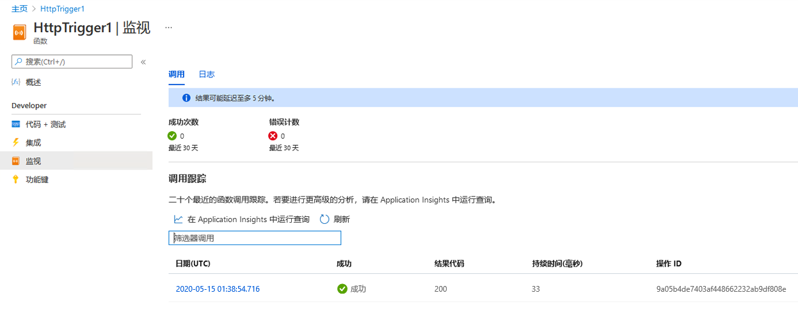

---
wts:
  title: 08 - 实现 Azure Functions（5 分钟）
  module: 'Module 03: Describe core solutions and management tools'
---
# 08 - 实现 Azure Functions（5 分钟）

在本演练中，我们将创建一个函数应用，用于在出现 HTTP 请求时显示 Hello 消息。 

# 任务 1：创建函数应用 

在此任务中，我们将创建一个函数应用。

1. 登录 [Azure 门户](https://portal.azure.com)。

2. 在门户顶部的“搜索”栏中，搜索并选择“函数应用”，然后在“函数应用”边栏选项卡中，单击“+ 添加、+ 创建、+新建”   。

3. 在“函数应用”边栏选项卡的“基本信息”选项卡上，指定以下设置（将函数应用名称中的 xxxx 替换为字母和数字，使该名称在全局范围内唯一，并将所有其他设置保留为默认值）： 

    | 设置 | 值 |
    | -- | --|
    | 订阅 | 保留提供的默认值 |
    | 资源组 | **新建资源组** |
    | Function App 名称 | function-xxxx |
    | 发布 | **代码** |
    | 运行时堆栈 | **.NET** |
    | 版本 | **3.1** |
    | 区域 | **美国东部** |

    注意 - 请记住更改 xxxx 以使其成为唯一的函数应用名称

4. 单击“查看 + 创建”，然后在验证成功后，单击“创建”以开始预配和部署新的 Azure 函数应用 。

5. 等待说明已创建资源的通知出现。

6. When the deployment has completed, click Go to resource from the deployment blade. Alternatively, navigate back to the <bpt id="p1">**</bpt>Function App<ept id="p1">**</ept> blade, click <bpt id="p2">**</bpt>Refresh<ept id="p2">**</ept> and verify that the newly created function app has the <bpt id="p3">**</bpt>Running<ept id="p3">**</ept> status. 

    

# 任务 2：创建一个 HTTP 触发的函数并对其进行测试

在此任务中，我们将使用 Webhook + API 函数，用于在出现 HTTP 请求时显示消息。 

1. 在“函数应用”边栏选项卡上，单击新创建的函数应用。 

2. 在“函数应用”边栏选项卡的“函数”部分，单击“函数”，然后单击“+ 添加、+ 创建、+ 新建”  。

    

3. An <bpt id="p1">**</bpt>Add function<ept id="p1">**</ept> pop-up window will appear on the right. In the <bpt id="p1">**</bpt>Select a template<ept id="p1">**</ept> section click <bpt id="p2">**</bpt>HTTP trigger<ept id="p2">**</ept>. Click <bpt id="p1">**</bpt>Add<ept id="p1">**</ept> 

    

4. 在 HttpTrigger1 边栏选项卡的“开发人员”部分，单击“编码 + 测试”。 

5. On the <bpt id="p1">**</bpt>Code + Test<ept id="p1">**</ept> blade, review the auto-generated code and note that the code is designed to run an HTTP request and log information. Also, notice the function returns a Hello message with a name. 

    

6. 在函数编辑器顶部单击“获取函数 URL”。 

7. 请确保“密钥”下拉列表中的值设置为默认值，并单击“复制”以复制函数 URL  。 

    

8. Open a new browser tab and paste the copied function URL into your web browser's address bar. When the page is requested the function will run. Notice the returned message stating that the function requires a name in the request body.

    

9. 将 &name=*yourname* 附加到 URL 的末尾。

    **注意**：例如，如果你的名字是 Cindy，最终 URL 将与以下所示类似：`https://azfuncxxx.azurewebsites.net/api/HttpTrigger1?code=X9xx9999xXXXXX9x9xxxXX==&name=cindy`

    

10. When you hit enter, your function runs and every invocation is traced. To view the traces, return to the Portal <bpt id="p1">**</bpt>HttpTrigger1 <ph id="ph1">\|</ph> Code + Test<ept id="p1">**</ept> blade and click <bpt id="p2">**</bpt>Monitor<ept id="p2">**</ept>. You can <bpt id="p1">**</bpt>configure<ept id="p1">**</ept> Application Insights by selecting the timestamp and click <bpt id="p2">**</bpt>Run query in Application Insights<ept id="p2">**</ept>.

     

Congratulations! You have created a Function App to display a Hello message when there is an HTTP request.  

<bpt id="p1">**</bpt>Note<ept id="p1">**</ept>: To avoid additional costs, you can optionally remove this resource group. Search for resource groups, click your resource group, and then click <bpt id="p1">**</bpt>Delete resource group<ept id="p1">**</ept>. Verify the name of the resource group and then click <bpt id="p1">**</bpt>Delete<ept id="p1">**</ept>. Monitor the <bpt id="p1">**</bpt>Notifications<ept id="p1">**</ept> to see how the delete is proceeding.
