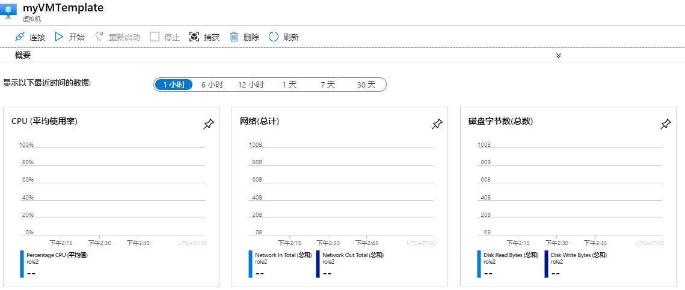
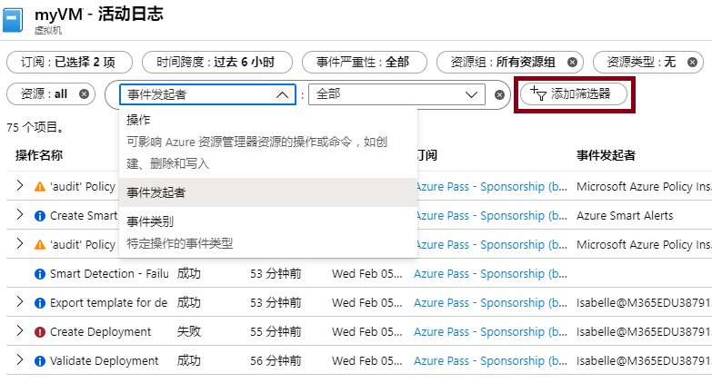

---
wts:
  title: 09 - 使用模板创建 VM（10 分钟）
  module: 'Module 03: Describe core solutions and management tools'
---
# 09 - 使用模板创建 VM（10 分钟）

在本演练中，我们将使用快速启动模板部署虚拟机并检查监视功能。

# 任务 1：了解快速入门库并找到模板 

在此任务中，我们将浏览 Azure 快速启动库并部署可创建虚拟机的模板。 

1. Within the lab environment, open a new browser window, and enter T <ph id="ph1">https://azure.microsoft.com/en-us/resources/templates/?azure-portal=true</ph>. In the gallery you will find a number of popular and recently updated templates. These templates automate deployment of Azure resources, including installation of popular software packages. Browse through the many different types of templates that are available.

3. 选择“部署一个简单的 Windows VM”

4. Click the <bpt id="p1">**</bpt>Deploy to Azure<ept id="p1">**</ept> button. Your browser session will be automatically redirected to the <bpt id="p1">[</bpt>Azure portal<ept id="p1">](http://portal.azure.com/)</ept>.

  <bpt id="p1">**</bpt>Note<ept id="p1">**</ept>: The <bpt id="p2">**</bpt>Deploy to Azure<ept id="p2">**</ept> button enables you to deploy the template via the Azure portal. During such deployment, you will be prompted only for small set of configuration parameters. 

5. 当系统出现提示时，请使用说明前面提供的凭据登录 Azure 订阅。

6. Click <bpt id="p1">**</bpt>Edit template<ept id="p1">**</ept>. The Resource Manager template format uses the JSON format. Review the parameters and variables.  Then locate the parameter for virtual machine name. Change the name to <bpt id="p1">**</bpt>myVMTemplate<ept id="p1">**</ept>. <bpt id="p1">**</bpt>Save<ept id="p1">**</ept> your changes. 

    

7. Now configure the parameters required by the template (replace <bpt id="p1">***</bpt>xxxx<ept id="p1">***</ept> in the DNS label prefix with letters and digits such that the label is globally unique). Leave the defaults for everything else. 

    | 设置| 值|
    |----|----|
    | 订阅 | 保留提供的默认值|
    | 资源组 | **新建资源组** |
    | 区域 | 保留默认值 |
    | 管理员用户名 | **azureuser** |
    | 管理员密码 | **Pa$$w0rd1234** |
    | DNS 标签前缀 | myvmtemplatexxxx |
    | OS 版本 | **2019-Datacenter** |

9. 单击“查看 + 创建”。

10. 监视你的部署。 

# 任务 2：验证和监视虚拟机部署

在此任务中，我们将验证虚拟机是否已正确部署。 

1. 从“所有服务”边栏选项卡，搜索并选择“虚拟机” 。

2. 确保已创建新的虚拟机。 

    

3. 选择你的虚拟机，然后在“概述”窗格中选择“监视”选项卡，向下滚动以查看监视数据 。

    **注意**：监视时间范围可以在 1 小时和 30 天之间进行调整。

4. 查看提供的不同图表，包括 CPU（平均值）、网络（总计）和磁盘字节（总计）  。 

    

5. 在实验室环境中，打开一个新的浏览器窗口，然后输入 T https://azure.microsoft.com/en-us/resources/templates/?azure-portal=true 。

6. 在该库中，你将找到许多最近更新的热门模板。
7. 这些模板可自动部署 Azure 资源，包括安装常用软件包。 

8. 单击“添加筛选器”，并尝试搜索其他事件类型和操作。 

    

浏览多种不同类型的可用模板。

<bpt id="p1">**</bpt>Note<ept id="p1">**</ept>: To avoid additional costs, you can optionally remove this resource group. Search for resource groups, click your resource group, and then click <bpt id="p1">**</bpt>Delete resource group<ept id="p1">**</ept>. Verify the name of the resource group and then click <bpt id="p1">**</bpt>Delete<ept id="p1">**</ept>. Monitor the <bpt id="p1">**</bpt>Notifications<ept id="p1">**</ept> to see how the delete is proceeding.
