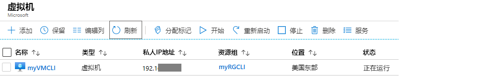
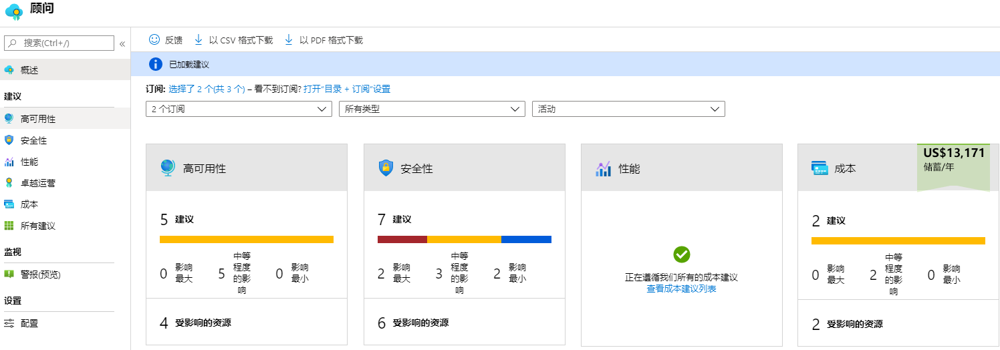
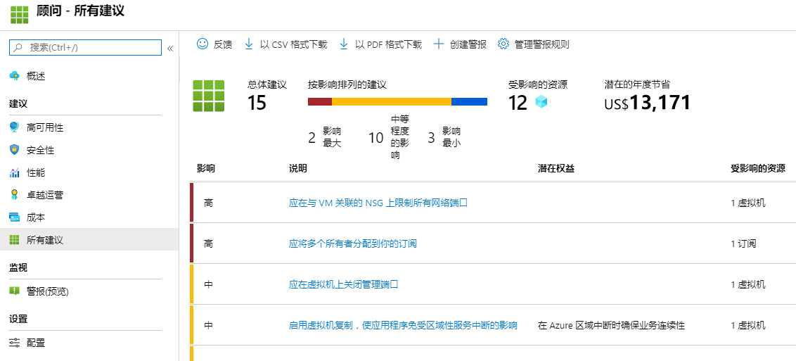

---
wts:
  title: 10 - 使用 PowerShell 创建 VM（10 分钟）
  module: 'Module 03: Describe core solutions and management tools'
---
# <a name="10---create-a-vm-with-powershell-10-min"></a>10 - 使用 PowerShell 创建 VM（10 分钟）

在本演练中，我们将配置 Cloud Shell，使用 Azure PowerShell 模块创建资源组和虚拟机，并查看 Azure 顾问建议。 

# <a name="task-1-configure-the-cloud-shell"></a>任务 1：配置 Cloud Shell 

在此任务中，我们将配置 Cloud Shell。 

1. 登录到 [Azure 门户](https://portal.azure.com)。**你可以在资源选项卡（此“说明”选项卡旁边！）中找到登录凭据**
2. 单击 Azure 门户右上方的图标，在 Azure 门户中打开 Azure Cloud Shell。

    

3. 提示选择“Bash”或“PowerShell”时，选择“PowerShell”  。

4. 在“你没有安装任何存储”屏幕中，选择“显示高级设置”，然后填写以下信息 

    | 设置 | 值 |
    |  -- | -- |
    | 资源组 | **新建资源组** |
    | 存储帐户（新建一个帐户并使用全局唯一名称，例如 cloudshellstoragemystorage） | cloudshellxxxxxxx |
    | 文件共享（新建） | shellstorage |

5. 选择“创建存储”

# <a name="task-2-create-a-resource-group-and-virtual-machine"></a>任务 2：创建资源组和虚拟机

在此任务中，我们将使用 PowerShell 创建资源组和虚拟机。  

1. 确保在“Cloud Shell”窗格左上方的下拉菜单中选中“PowerShell”。

2. Verify your new resource group by running the following command in the Powershell window. Press <bpt id="p1">**</bpt>Enter<ept id="p1">**</ept> to run the command.

    ```PowerShell
    Get-AzResourceGroup | Format-Table
    ```

3. 将以下命令粘贴到终端窗口，创建虚拟机。 

    ```PowerShell
    New-AzVm `
    -ResourceGroupName "myRGPS" `
    -Name "myVMPS" `
    -Location "East US" `
    -VirtualNetworkName "myVnetPS" `
    -SubnetName "mySubnetPS" `
    -SecurityGroupName "myNSGPS" `
    -PublicIpAddressName "myPublicIpPS"
    ```
    
4. 当系统出现提示时，提供将被配置为该虚拟 machines.azureadmin 上的本地管理员帐户的用户名 (azureuser) 和密码 (Pa$$w0rd1234) 

5. 创建 VM 后，关闭 Cloud Shell 窗格的 PowerShell 会话。

6. In the Azure portal, search for <bpt id="p1">**</bpt>Virtual machines<ept id="p1">**</ept> and verify the <bpt id="p2">**</bpt>myVMPS<ept id="p2">**</ept> is running. This may take a few minutes.

    

7. 访问新虚拟机并查看“概述”和“联网”设置，以验证是否已正确部署你的信息。 

# <a name="task-3-execute-commands-in-the-cloud-shell"></a>任务 3：在 Cloud Shell 中执行命令

在此任务中，我们将练习从 Cloud Shell 执行 PowerShell 命令。 

1. 单击 Azure 门户右上方的图标，在 Azure 门户中打开 Azure Cloud Shell。

2. 确保在“Cloud Shell”窗格左上方的下拉菜单中选中“PowerShell”。

3. Retrieve information about your virtual machine including name, resource group, location, and status. Notice the PowerState is <bpt id="p1">**</bpt>running<ept id="p1">**</ept>.

    ```PowerShell
    Get-AzVM -name myVMPS -status | Format-Table -autosize
    ```

4. 使用以下命令停止虚拟机。 

    ```PowerShell
    Stop-AzVM -ResourceGroupName myRGPS -Name myVMPS
    ```
5. When prompted confirm (Yes) to the action. Wait for <bpt id="p1">**</bpt>Succeeded<ept id="p1">**</ept> status.

6. Verify your virtual machine state. The PowerState should now be <bpt id="p1">**</bpt>deallocated<ept id="p1">**</ept>. You can also verify the virtual machine status in the portal. Close Cloudshell.

    ```PowerShell
    Get-AzVM -name myVMPS -status | Format-Table -autosize
    ```

# <a name="task-4-review-azure-advisor-recommendations"></a>任务 4：查看 Azure 顾问建议

**注意：** “使用 Azure CLI 创建 VM”实验室中存在同样的任务。 

在此任务中，我们将查看针对虚拟机的 Azure 顾问建议。 

1. 从“所有服务”边栏选项卡，搜索并选择“顾问” 。 

2. On the <bpt id="p1">**</bpt>Advisor<ept id="p1">**</ept> blade, select <bpt id="p2">**</bpt>Overview<ept id="p2">**</ept>. Notice recommendations are grouped by Reliability, Security, Performance, and Cost. 

    

3. 选择“所有建议”并花一些时间查看每个建议和建议的操作。 

    **注意：** 建议会根据资源情况而有所不同。 

    

4. 请注意，可将建议下载为 CSV 或 PDF 文件。 

5. 请注意，你可以创建警报。 

6. 如有时间，请继续尝试使用 Azure PowerShell。 

Congratulations! You have configured Cloud Shell, created a virtual machine using PowerShell, practiced with PowerShell commands, and viewed Advisor recommendations.

<bpt id="p1">**</bpt>Note<ept id="p1">**</ept>: To avoid additional costs, you can optionally remove this resource group. Search for resource groups, click your resource group, and then click <bpt id="p1">**</bpt>Delete resource group<ept id="p1">**</ept>. Verify the name of the resource group and then click <bpt id="p1">**</bpt>Delete<ept id="p1">**</ept>. Monitor the <bpt id="p1">**</bpt>Notifications<ept id="p1">**</ept> to see how the delete is proceeding.
