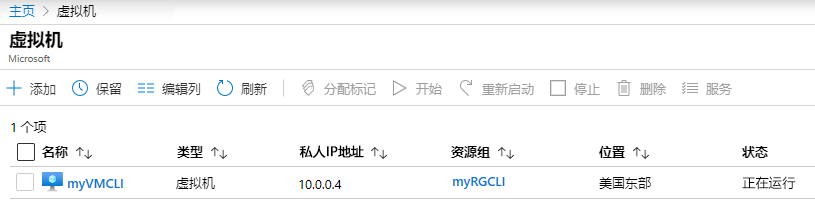

---
wts:
  title: 11 - 使用 CLI 创建 VM（10 分钟）
  module: 'Module 03: Describe core solutions and management tools'
---
# <a name="11---create-a-vm-with-the-cli-10-min"></a>11 - 使用 CLI 创建 VM（10 分钟）

在本演练中，我们将配置 Cloud Shell，使用 Azure CLI 创建资源组和虚拟机，并查看 Azure 顾问建议。 

# <a name="task-1-configure-the-cloud-shell"></a>任务 1：配置 Cloud Shell 

在此任务中，我们将配置 Cloud Shell，然后使用 Azure CLI 创建资源组和虚拟机。  

1. 登录 [Azure 门户](https://portal.azure.com)。

2. 单击 Azure 门户右上方的图标，在 Azure 门户中打开 Azure Cloud Shell。

    
   
3. 在“欢迎使用 Azure Cloud Shell”对话框中，当系统提示选择 Bash 或 PowerShell 时，选择 Bash  。 

4. A new window will open stating <bpt id="p1">**</bpt>You have no storage mounted<ept id="p1">**</ept>. Select <bpt id="p1">**</bpt>advanced settings<ept id="p1">**</ept>.

5. 在“高级设置”屏幕中，填写以下字段，然后单击“创建存储”：
    - 资源组：创建新的资源组
    - 存储帐户：新建使用全局唯一名称的帐户（例如 cloudshellxyzstorage）
    - 文件共享：创建一个新文件共享并将其命名为 cloudshellfileshare


# <a name="task-2-use-cli-to-create-a-virtual-machine"></a>任务 2：使用 CLI 创建虚拟机

在此任务中，我们将使用 Azure CLI 创建资源组和虚拟机。

1. 确保在 Cloud Shell 窗格左上方的下拉菜单中选择 Bash（如果未选择，请进行选择）。

    


2. 输入以下命令验证正在使用的资源组。

    ```cli
    az group list --output table
    ```

4. In Cloud Shell enter the command below and make sure that each line, except for the last one, is followed by the backslash (<ph id="ph1">`\`</ph>) character. If you type the whole command on the same line, do not use any backslash characters. 

    ```cli
    az vm create \
    --name myVMCLI \
    --resource-group myRGCLI \
    --image UbuntuLTS \
    --location EastUS2 \
    --admin-username azureuser \
    --admin-password Pa$$w0rd1234
    ```

    >**注意**：如果在 Windows 计算机上使用此命令行，请将反斜杠 (`\`) 字符替换为脱字符 (`^`)。

    <bpt id="p1">**</bpt>Note<ept id="p1">**</ept>: The command will take 2 to 3 minutes to complete. The command will create a virtual machine and various resources associated with it such as storage, networking and security resources. Do not continue to the next step until the virtual machine deployment is complete. 

5. 命令完成运行后，在浏览器窗口关闭 Cloud Shell 窗格。

6. 在 Azure 门户中，搜索“虚拟机”并验证 myVMCLI 是否正在运行 。

    


# <a name="task-3-execute-commands-in-the-cloud-shell"></a>任务 3：在 Cloud Shell 中执行命令

在此任务中，我们将练习从 Cloud Shell 执行 CLI 命令。 

1. 单击 Azure 门户右上方的图标，在 Azure 门户中打开 Azure Cloud Shell。

2. 确保在 Cloud Shell 窗格左上方的下拉菜单中选择 Bash。

3. Retrieve information about the virtual machine you provisioned, including name, resource group, location, and status. Notice the PowerState is <bpt id="p1">**</bpt>running<ept id="p1">**</ept>.

    ```cli
    az vm show --resource-group myRGCLI --name myVMCLI --show-details --output table 
    ```

4. Stop the virtual machine. Notice the message that billing continues until the virtual machine is deallocated. 

    ```cli
    az vm stop --resource-group myRGCLI --name myVMCLI
    ```

5. Verify your virtual machine status. The PowerState should now be <bpt id="p1">**</bpt>stopped<ept id="p1">**</ept>.

    ```cli
    az vm show --resource-group myRGCLI --name myVMCLI --show-details --output table 
    ```

# <a name="task-4-review-azure-advisor-recommendations"></a>任务 4：查看 Azure 顾问建议

在此任务中，我们将查看 Azure 顾问建议。

   **注意：** 如果已完成上一个实验室（使用 PowerShell 创建 VM），那么就已执行此任务。 

1. 从“所有服务”边栏选项卡，搜索并选择“顾问” 。 

2. On the <bpt id="p1">**</bpt>Advisor<ept id="p1">**</ept> blade, select <bpt id="p2">**</bpt>Overview<ept id="p2">**</ept>. Notice recommendations are grouped by Reliability, Security, Performance, and Cost. 

    

3. 选择“所有建议”并花一些时间查看每个建议和建议的操作。 

    **注意：** 建议会根据资源情况而有所不同。 

    

4. 请注意，可将建议下载为 CSV 或 PDF 文件。 

5. 请注意，你可以创建警报。 

6. 如有时间，请继续尝试使用 Azure CLI。 

Congratulations! You have configured Cloud Shell, created a virtual machine using Azure CLI, practiced with Azure CLI commands, and viewed Advisor recommendations.

<bpt id="p1">**</bpt>Note<ept id="p1">**</ept>: To avoid additional costs, you can optionally remove this resource group. Search for resource groups, click your resource group, and then click <bpt id="p1">**</bpt>Delete resource group<ept id="p1">**</ept>. Verify the name of the resource group and then click <bpt id="p1">**</bpt>Delete<ept id="p1">**</ept>. Monitor the <bpt id="p1">**</bpt>Notifications<ept id="p1">**</ept> to see how the delete is proceeding.
