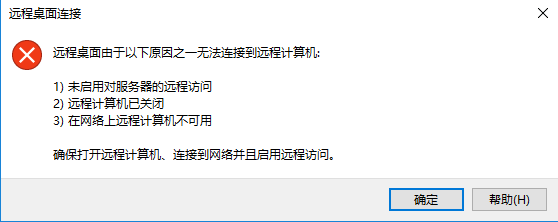

---
wts:
  title: 13 - 保护网络流量（10 分钟）
  module: 'Module 04: Describe general security and network security features'
---
# 13 - 保护网络流量（10 分钟）

在此演练中，我们将配置一个网络安全组。

# 任务 1：创建虚拟机

在此任务中，我们将创建 Windows Server 2019 Datacenter 虚拟机。 

1. 登录 [Azure 门户](https://portal.azure.com)。

2. 从“所有服务”边栏选项卡，搜索并选择“虚拟机”，然后单击“+ 添加 + 创建 + 新建”虚拟机  。

3. 在“基本”选项卡上，填写以下信息（其他所有设置保留默认值）：

    | 设置 | 值 |
    |  -- | -- |
    | 订阅 | 使用提供的默认值 |
    | 资源组 | **新建资源组** |
    | 虚拟机名称 | SimpleWinVM |
    | 区域 | **（美国）美国东部**|
    | 映像 | Windows Server 2019 Datacenter - Gen 2|
    | 大小 | Standard D2s v3|
    | 管理员帐户用户名 | **azureuser** |
    | 管理员帐户密码 | **Pa$$w0rd1234**|
    | 入站端口规则 | **无**|

4. 切换到“联网”选项卡，然后配置以下设置：

    | 设置 | 值 |
    | -- | -- |
    | NIC 网络安全组 | **无**|

5. 切换到“管理”选项卡，然后在其“监视”部分中选择以下设置 ：

    | 设置 | 值 |
    | -- | -- |
    | 启动诊断 | **禁用**|

6. 保留其余默认值，然后单击页面底部的“查看 + 创建”按钮。

7. Once Validation is passed click the <bpt id="p1">**</bpt>Create<ept id="p1">**</ept> button. It can take about five minutes to deploy the virtual machine.

8. Monitor the deployment. It may take a few minutes for the resource group and virtual machine to be created. 

9. 在部署边栏选项卡或从“通知”区域，单击“前往资源”。 

10. 在 SimpleWinVM 虚拟机边栏选项卡上，单击“联网”，查看“入站端口规则”选项卡，并注意没有与虚拟机的网络接口或网络接口所连接的子网关联的网络安全组  。

    <bpt id="p1">**</bpt>Note<ept id="p1">**</ept>: Identify the name of the network interface. You will need it in the next task.

# 任务 2：创建网络安全组

在本任务中，我们将创建一个网络安全组并将其与网络接口关联。 

1. 从“所有服务”边栏选项卡，搜索并选择“网络安全组”，然后单击“+ 添加 +创建 + 新建”。

2. 在“创建网络安全组”边栏选项卡的“基本”选项卡中，指定以下设置：

    | 设置 | 值 |
    | -- | -- |
    | 订阅 | 使用默认订阅 |
    | 资源组 | 从下拉列表中选择默认值 |
    | 名称 | myNSGSecure |
    | 区域 | **（美国）美国东部**  |

3. 单击“查看 + 创建”，然后在验证后单击“创建”。

4. 创建 NSG 后，单击“前往资源”。

5. 在“设置”下，单击“网络接口”，然后单击**“关联”**。

6. 选择你在上一个任务中识别的网络接口。 

# 任务 3：配置入站安全端口规则以允许 RDP

在此任务中，我们将通过配置入站安全端口规则来允许虚拟机的 RDP 流量。 

1. 在 Azure 门户中，导航到 SimpleWinVM 虚拟机的边栏选项卡。 

2. 在“概述”窗格中，单击“连接”。

3. Attempt to connect to the virtual machine by selecting RDP and downloading an running the RDP file. By default the network security group does not allow RDP. Close the error window. 

    

4. 在虚拟机边栏选项卡上，向下滚动到“设置”部分，单击“联网”，然后注意“myNSGSecure（附加到网络接口: myVMNic）”网络安全组的入站规则拒绝除虚拟网络和负载均衡器探测中的流量外的所有入站流量  。

5. On the <bpt id="p1">**</bpt>Inbound port rules<ept id="p1">**</ept> tab, click <bpt id="p2">**</bpt>Add inbound port rule<ept id="p2">**</ept> . Click <bpt id="p1">**</bpt>Add<ept id="p1">**</ept> when you are done. 

    | 设置 | 值 |
    | -- | -- |
    | 源 | **任意**|
    | 源端口范围 | **\*** |
    | 目标 | **任意** |
    | 目标端口范围 | **3389** |
    | 协议 | **TCP** |
    | 操作 | **允许** |
    | 优先级 | **300** |
    | 名称 | AllowRDP |

6. Select <bpt id="p1">**</bpt>Add<ept id="p1">**</ept> and wait for the rule to be provisioned and then try again to RDP into the virtual machine by going back to <bpt id="p2">**</bpt>Connect<ept id="p2">**</ept> This time you should be successful. Remember the user is <bpt id="p1">**</bpt>azureuser<ept id="p1">**</ept> and the password is <bpt id="p2">**</bpt>Pa$$w0rd1234<ept id="p2">**</ept>.

# 任务 4：配置出站安全端口规则以拒绝 Internet 访问

在此任务中，我们将创建会拒绝 Internet 访问的 NSG 出站端口规则，然后对其进行测试以确保该规则正常工作。

1. 在你的虚拟机 RDP 会话中继续。 

2. 计算机启动后，打开 Internet Explorer 浏览器。 

3. Verify that you can access <bpt id="p1">**</bpt><ph id="ph1">https://www.bing.com</ph><ept id="p1">**</ept> and then close Internet Explorer. You will need to work through the IE enhanced security pop-ups. 

    **注意**：现在，我们将配置一个规则以拒绝出站 Internet 访问。 

4. 返回 Azure 门户，导航回 SimpleWinVM 虚拟机的边栏选项卡。 

5. 在“设置”下，单击“联网”，然后单击“出站端口规则”  。

6. Notice there is a rule, <bpt id="p1">**</bpt>AllowInternetOutbound<ept id="p1">**</ept>. This a default rule and cannot be removed. 

7. Click <bpt id="p1">**</bpt>Add outbound port rule<ept id="p1">**</ept> to the right of the <bpt id="p2">**</bpt>myNSGSecure  (attached to network interface: myVMNic)<ept id="p2">**</ept> network security group and configure a new outbound security rule with a higher priority that will deny internet traffic. Click <bpt id="p1">**</bpt>Add<ept id="p1">**</ept> when you are finished. 

    | 设置 | 值 |
    | -- | -- |
    | 源 | **任意**|
    | 源端口范围 | **\*** |
    | 目标 | **服务标记** |
    | 目标服务标记 | **Internet** |
    | 目标端口范围 | **\*** |
    | 协议 | **TCP** |
    | 操作 | **拒绝** |
    | 优先级 | **4000** |
    | 名称 | DenyInternet |

8. 单击“添加”以返回到 RDP 的 VM。 

9. Browse to <bpt id="p1">**</bpt><ph id="ph1">https://www.microsoft.com</ph><ept id="p1">**</ept>. The page should not display. You may need to work through additional IE enhanced security pop-ups.  

<bpt id="p1">**</bpt>Note<ept id="p1">**</ept>: To avoid additional costs, you can optionally remove this resource group. Search for resource groups, click your resource group, and then click <bpt id="p1">**</bpt>Delete resource group<ept id="p1">**</ept>. Verify the name of the resource group and then click <bpt id="p1">**</bpt>Delete<ept id="p1">**</ept>. Monitor the <bpt id="p1">**</bpt>Notifications<ept id="p1">**</ept> to see how the delete is proceeding.
