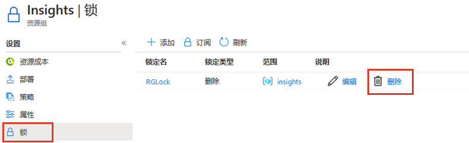

---
wts:
  title: 15 - 管理资源锁（5 分钟）
  module: 'Module 05: Describe identity, governance, privacy, and compliance features'
---
# 15 - 管理资源锁（5 分钟）

In this walkthrough, we will add a lock to the resource group and test deleting the resource group. Locks can be applied in a subscription to resource groups, or individual resources to prevent accidental deletion or modification of critical resources.  

# 任务 1：向资源组添加锁并测试删除

在此任务中，我们将向资源组添加资源锁，并测试删除该资源组。 

1. 登录 [Azure 门户](https://portal.azure.com)。

2. 在 Azure 门户中，导航到资源组 myRGLocks。

3. 可以将锁应用于订阅、资源组或单个资源，以防止意外删除或修改关键资源。 

4. 在“设置”部分单击“锁”，然后单击“+ 添加”。 

    

5. Configure the new lock. When you are done click <bpt id="p1">**</bpt>OK<ept id="p1">**</ept>. 

    | 设置 | 值 |
    | -- | -- |
    | 锁名称 | '''RGLock''' |
    | 锁类型 | **删除** |
    | | |

6. Click <bpt id="p1">**</bpt>Overview<ept id="p1">**</ept> and click <bpt id="p2">**</bpt>Delete resource group<ept id="p2">**</ept>. Type the name of the resource group and click <bpt id="p1">**</bpt>OK<ept id="p1">**</ept>. You receive an error message stating the resource group is locked and can't be deleted.

    

# 任务 2：测试删除资源组的成员

在此任务中，我们将测试资源锁是否会保护资源组中的存储帐户。 

1. 在“所有服务”边栏选项卡中，搜索并选择“存储帐户”，然后单击“+ 添加”、“+ 创建”或“+ 新建”  。 

2. 在本演练中，我们将向资源组添加一个锁，并测试删除该资源组。

    | 设置 | 值 | 
    | --- | --- |
    | 订阅 | 选择订阅 |
    | 资源组 | myRGLocks |
    | 存储帐户名称 | storageaccountxxxx |
    | 位置 | **（美国）美国东部**  |
    | 性能 | **标准** |
    | 帐户类型 | **StorageV2（常规用途 v2）** |
    | 复制 | **本地冗余存储 (LRS)** |
    | 访问层（默认） | **热访问层** |
   

3. 单击“查看 + 创建”查看存储帐户设置并允许 Azure 验证配置。 

4. 可以在资源组或单个资源的订阅中应用锁，以防止意外删除或修改关键资源。 

5.  等待告知存储帐户已创建成功的通知。 

6. Access your new storage account and from the <bpt id="p1">**</bpt>Overview<ept id="p1">**</ept> pane, click <bpt id="p2">**</bpt>Delete<ept id="p2">**</ept>. You receive an error message stating the resource or its parent has a delete lock. 

    

    <bpt id="p1">**</bpt>Note<ept id="p1">**</ept>: Although we did not create a lock specifically for the storage account, we did create a lock at the resource group level, which contains the storage account. As such, this <bpt id="p1">*</bpt>parent<ept id="p1">*</ept> level lock prevents us from deleting the resource and the storage account inherits the lock from the parent.

# 任务 3：删除资源锁

在此任务中，我们将删除资源锁并进行测试。 

1. 返回“myRGLocks-XXXXXXXX”资源组边栏选项卡，然后在“设置”部分单击“锁”  。
    
2. 单击“编辑”右侧的“myRGLocks-XXXXXXXX”条目最右侧的“删除”链接  。

    

3. 返回到存储帐户边栏选项卡，并确认你现在可删除资源。

Congratulations! You created a resource group, added a lock to resource group and tested deletion, tested deleting a resource in the resource group, and removed the resource lock. 

<bpt id="p1">**</bpt>Note<ept id="p1">**</ept>: To avoid additional costs, you can optionally remove this resource group. Search for resource groups, click your resource group, and then click <bpt id="p1">**</bpt>Delete resource group<ept id="p1">**</ept>. Verify the name of the resource group and then click <bpt id="p1">**</bpt>Delete<ept id="p1">**</ept>. Monitor the <bpt id="p1">**</bpt>Notifications<ept id="p1">**</ept> to see how the delete is proceeding.
