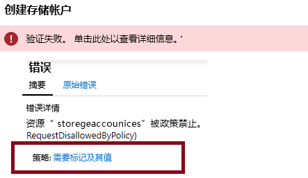
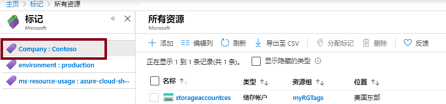
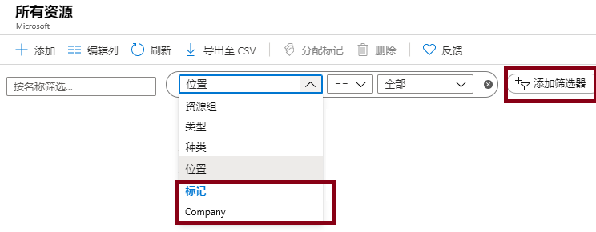

---
wts:
  title: 16 - 实现资源标记（5 分钟）
  module: 'Module 05: Describe identity, governance, privacy, and compliance features'
---
# 16 - 实现资源标记（5 分钟）

在本演练中，我们将创建一个要求标记的策略分配、创建一个存储帐户并测试该标记、查看带有指定标记的资源，并删除该标记策略。

# 任务 1：创建策略分配 

在此任务中，我们将配置“资源需要标记”策略，并将其分配给我们的订阅。 

1. 登录到 [Azure 门户](https://portal.azure.com)。

2. 在“所有服务”边栏选项卡中，搜索并选择“策略” 。

3. 向下滚动到“创作”部分，单击“分配”，然后在页面顶部单击“分配策略”。

4. 注意，我们策略的“范围”覆盖整个订阅。 

5. Under <bpt id="p1">**</bpt>Basics<ept id="p1">**</ept> Select the <bpt id="p2">**</bpt>Policy definition<ept id="p2">**</ept> ellipsis button (right side of textbox). In the <bpt id="p1">**</bpt>Search<ept id="p1">**</ept> box, enter the value <bpt id="p2">**</bpt>tag<ept id="p2">**</ept>. A list of related Policies with the word <bpt id="p1">**</bpt>tag<ept id="p1">**</ept> will appear. Scroll down till you find the <bpt id="p1">**</bpt>Require a tag and its value on resources<ept id="p1">**</ept> definition, click on it and click <bpt id="p2">**</bpt>Select<ept id="p2">**</ept>.

   
   
6.  On the <bpt id="p1">**</bpt>Parameters<ept id="p1">**</ept> tab, type in **Company : Contoso ** for the tag key/value pair name. Click <bpt id="p1">**</bpt>Review + create<ept id="p1">**</ept>, and then <bpt id="p2">**</bpt>Create<ept id="p2">**</ept>.

  

7. The <bpt id="p1">**</bpt>Require a tag amd its value on resources<ept id="p1">**</ept> policy assignment is now in place. When a resource is created, it must include a tag with the Company : Contoso key.
   <bpt id="p1">**</bpt>Note - you need to wait up to 30 minutes for the Policy to be applied.<ept id="p1">**</ept> 

  

# 任务 2：创建一个存储帐户以测试所需的标记

在此任务中，我们将创建存储帐户以测试所需的标记。 

1. 在 Azure 门户的“所有服务”边栏选项卡中，搜索并选择“存储帐户”，然后单击“+ 添加 + 新建 + 创建”  。

2. On the <bpt id="p1">**</bpt>Basics<ept id="p1">**</ept> tab of the <bpt id="p2">**</bpt>Create storage account<ept id="p2">**</ept> blade, fill in the following information (replace <bpt id="p3">**</bpt>xxxx<ept id="p3">**</ept> in the name of the storage account with letters and digits such that the name is globally unique). Leave the defaults for everything else.

    | 设置 | 值 | 
    | --- | --- |
    | 订阅 | 使用提供的默认值 |
    | 资源组 | **新建资源组** |
    | 存储帐户名称 | storageaccountxxxx |
    | 位置 | **（美国）美国东部** |

3. 单击“查看 + 创建”。 

    <bpt id="p1">**</bpt>Note:<ept id="p1">**</ept> We are testing to see what happens when the tag is not supplied. Please note, it can take up to 30 minutes for Policies to take effect.

4. You will receive a Validation failed message. Click the <bpt id="p1">**</bpt>Click here to view details<ept id="p1">**</ept> message. On the <bpt id="p1">**</bpt>Errors<ept id="p1">**</ept> blade, on the <bpt id="p2">**</bpt>Summary<ept id="p2">**</ept> tab note the error message stating that resource was disallowed by Policy.

    **注意：** 如果查看“原始错误”选项卡，将看到要求的特定标记名称。 

    

5. Close the <bpt id="p1">**</bpt>Error<ept id="p1">**</ept> pane and click <bpt id="p2">**</bpt>Previous<ept id="p2">**</ept> (bottom of the screen). Provide the tagging information. 

    | 设置 | 值 | 
    | --- | --- |
    | 标记名称 | Company:Contoso（可能不在下拉列表中） |

6. Click <bpt id="p1">**</bpt>Review + create<ept id="p1">**</ept> and verify that the validation was successful. Click <bpt id="p1">**</bpt>Create<ept id="p1">**</ept> to deploy the storage account. 

# 任务 3：查看带有特定标记的所有资源

1. 在 Azure 门户的“所有服务”边栏选项卡中，搜索并选择“标记”。

2. Note all tags and their values. Click the <bpt id="p1">**</bpt>Company : Contoso<ept id="p1">**</ept> key/value pair. This will display a blade showing the newly created storage account, as long as you included the tag during its deployment. 

   

3. 在门户中，显示“所有资源”边栏选项卡。

4. Click <bpt id="p1">**</bpt>Add filter<ept id="p1">**</ept> and add the <bpt id="p2">**</bpt>Company<ept id="p2">**</ept> tag key as the filter category. With the filter applied, only your storage account will be listed.

    

# 任务 4：删除策略分配

在此任务中，我们将删除“资源需要标记”策略，以免影响我们后续的工作。 

1. 在门户的“所有服务”边栏选项卡中，搜索并选择“策略”。

2. 单击“资源需要标记”策略条目。

3. 在顶部菜单中单击“删除分配”。

4. 通过在“删除分配”对话框中单击“是”，确认希望删除策略分配 

5. 如果有时间，请尝试创建另一个不含标记的资源以确保该策略不再有效。

在“基本信息”下选择“策略定义”省略号按钮（文本框右侧） 。

在“搜索”框中，输入值“标记” 。
