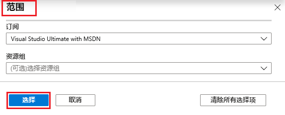

---
wts:
  title: 17 - 创建 Azure 策略（10 分钟）
  module: 'Module 05: Describe identity, governance, privacy, and compliance features'
---
# 17 - 创建 Azure 策略（10 分钟）

在本演练中，我们将创建一个 Azure 策略，以将 Azure 资源的部署限制到特定位置。

# 任务 1：创建策略分配 

在此任务中，我们将配置“允许的位置”策略并将其分配给我们的订阅。 

1. 登录 [Azure 门户](https://portal.azure.com)。

2. From the <bpt id="p1">**</bpt>All services<ept id="p1">**</ept> blade, search for and select <bpt id="p2">**</bpt>Policy<ept id="p2">**</ept>, under the <bpt id="p3">**</bpt>Authoring<ept id="p3">**</ept> section click <bpt id="p4">**</bpt>Definitions<ept id="p4">**</ept>.  Take a moment to review the list of built-in policy definitions. For example, in the <bpt id="p1">**</bpt>Category<ept id="p1">**</ept> drop-down select only <bpt id="p2">**</bpt>Compute<ept id="p2">**</ept>. Notice the <bpt id="p1">**</bpt>Allowed virtual machine size SKUs<ept id="p1">**</ept> definition enables you to specify a set of virtual machine SKUs that your organization can deploy.

3. Return to the <bpt id="p1">**</bpt>Policy<ept id="p1">**</ept> page, under the <bpt id="p2">**</bpt>Authoring<ept id="p2">**</ept> section click <bpt id="p3">**</bpt>Assignments<ept id="p3">**</ept>. An assignment is a policy that has been assigned to take place within a specific scope. For example, a definition could be assigned to the subscription scope. 

4. 单击“策略 - 分配”页面顶部的“分配策略” 。

5. 在“分配策略”页上，保留默认范围。

      | 设置 | 值 | 
    | --- | --- |
    | 范围| 使用选择的默认值|
    | 策略定义 | 单击省略号，然后搜索“允许的位置”，并选择 。 |
    | 分配名称 | 允许的位置 |
    
    
6. On the <bpt id="p1">**</bpt>Parameters<ept id="p1">**</ept> tab, select <bpt id="p2">**</bpt>Japan West<ept id="p2">**</ept>. Click <bpt id="p1">**</bpt>Review + create<ept id="p1">**</ept>, and then <bpt id="p2">**</bpt>Create<ept id="p2">**</ept>.

    <bpt id="p1">**</bpt>Note<ept id="p1">**</ept>: A scope determines what resources or grouping of resources the policy assignment applies to. In our case we could assign this policy to a specific resource group, however we chose to assign the policy at subscription level. Be aware that resources can be excluded based on the scope configuration. Exclusions are optional.

    <bpt id="p1">**</bpt>Note<ept id="p1">**</ept>: This <bpt id="p2">**</bpt>Allowed Locations<ept id="p2">**</ept> policy definition will specify a location into which all resources must be deployed. If a different location is chosen, deployment will not be allowed. For more information view the <bpt id="p1">[</bpt>Azure Policy Samples<ept id="p1">](https://docs.microsoft.com/en-us/azure/governance/policy/samples/index)</ept> page.

   

9. “允许的位置”策略分配现已列在“策略 - 分配”窗格中，该策略已设置好，可在我们指定的范围级别（订阅级别）强制执行该策略。

# 任务 2：测试“允许的位置”策略

在此任务中，我们将测试“允许的位置”策略。 

1. 在 Azure 门户的“所有服务”边栏选项卡中，搜索并选择“存储帐户”，然后单击“+ 创建”  。

2. Configure the storage account (replace <bpt id="p1">**</bpt>xxxx<ept id="p1">**</ept> in the name of the storage account with letters and digits such that the name is globally unique). Leave the defaults for everything else. 

    | 设置 | 值 | 
    | --- | --- |
    | 订阅 | 使用提供的默认值 |
    | 资源组 | myRGPolicy（新建） |
    | 存储帐户名称 | storageaccountxxxx |
    | 位置 | **（美国）美国东部** |

3. 依次单击“查看 + 创建”、“创建”。  

4. 你将收到说明策略不允许资源的部署失败错误，其中包含“允许的位置”策略名称 。

# 任务 3：删除策略分配

在此任务中，我们将删除“允许的位置”策略分配并进行测试。 

我们将删除策略分配，确保在以后需要做的任何工作中不会受阻。

1. 在“所有服务”边栏选项卡中，搜索并选择“策略”，然后单击“允许的位置”策略。

    **注意**：在“策略”边栏选项卡上，你可以查看已分配的各种策略的合规性状态。

    <bpt id="p1">**</bpt>Note<ept id="p1">**</ept>: The Allowed location policy may show non-compliant resources. If so, these are resources created prior to the policy assignment.
 
2. 单击“允许的位置”，这将打开“允许的位置”策略合规性窗口。

3. 在“所有服务”边栏选项卡中，搜索并选择“策略”，在“创作”部分，单击“定义”。

   

4. 尝试创建另一个存储帐户，确保该策略不再有效。

    **注意**：“允许的位置”策略适用于以下常见场景： 
    - 花一点时间查看内置策略定义列表。 
    - *数据驻留和安全合规性*：你还可能具有数据驻留要求，按客户或特定的工作负载创建订阅，并定义所有资源必须部署在特定数据中心中，以确保满足数据和安全合规性要求。

例如，在“类别”下拉列表中，仅选择“计算” 。

注意，利用“允许的虚拟机大小 SKU”定义，可以指定组织可部署的一组虚拟机 SKU。
