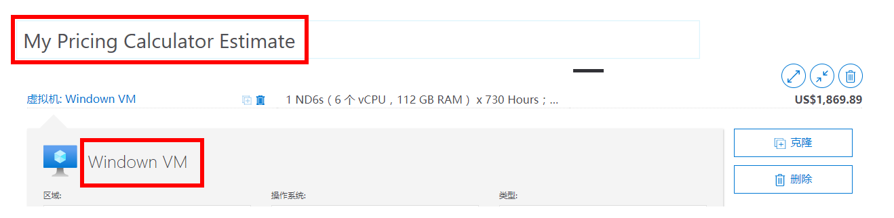
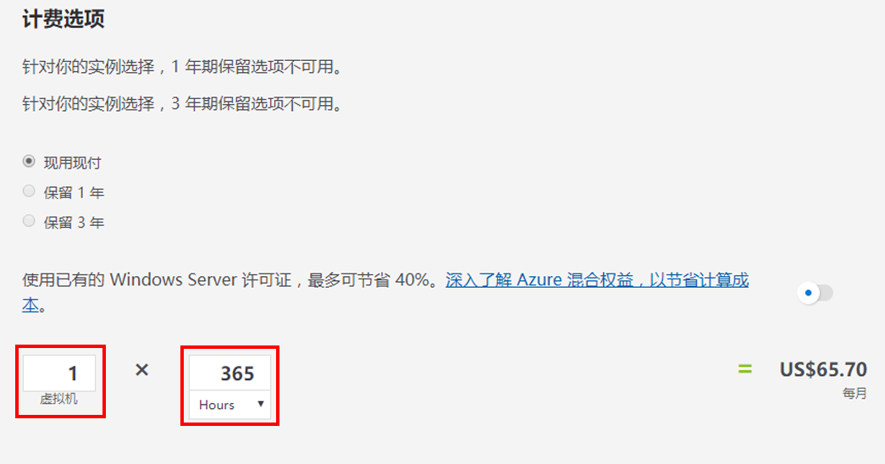
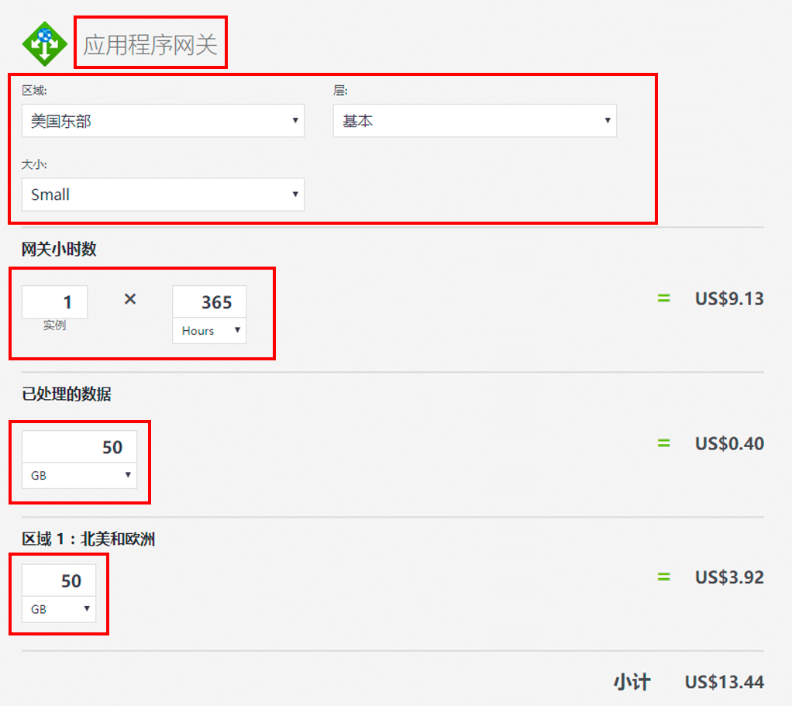

---
wts:
  title: 19 - 使用 Azure 定价计算器（10 分钟）
  module: 'Module 06: Describe Azure cost management and service level agreements'
---
# 19 - 使用 Azure 定价计算器（10 分钟）

在本演练中，我们将使用 Azure 定价计算器生成 Azure 虚拟机和相关网络资源的成本估算。

# 任务 1：配置定价计算器

在此任务中，我们将使用 Azure 定价计算器来估算示例基础结构的成本。 

<bpt id="p1">**</bpt>Note<ept id="p1">**</ept>: To create an Azure Pricing Calculator estimate, this walkthrough provides example configurations for the VM and related resources. Use this example configurations or provide the Azure Pricing Calculator with details of your <bpt id="p1">*</bpt>actual<ept id="p1">*</ept> resource requirements instead.

1. 在浏览器中，导航至 [Azure 定价计算器](https://azure.microsoft.com/en-us/pricing/calculator/)网页。

2. 要添加 VM 配置的详细信息，请在“产品”选项卡上单击“虚拟机” 。向下滚动以查看虚拟机的详细信息。 

3. Replace <bpt id="p1">**</bpt>Your Estimate<ept id="p1">**</ept> and <bpt id="p2">**</bpt>Virtual Machines<ept id="p2">**</ept> text with more descriptive names for your Azure Pricing Calculator estimate and your VM configuration. This walkthrough example uses <bpt id="p1">**</bpt>My Pricing Calculator Estimate<ept id="p1">**</ept> for the estimate, and <bpt id="p2">**</bpt>Windows VM<ept id="p2">**</ept> for the VM configuration.

   

4. 修改默认的 VM 配置。

    | 设置 | 值 |
    | -- | -- |
    | 区域 | **北欧** |
    | 操作系统 | **Windows** |
    | 类型 | （仅限 OS） |
    | 层 | **Standard** |  
    | 实例 | A2：**2 个核心，3.5 GB RAM，135 GB 临时存储** |

   

    <bpt id="p1">**</bpt>Note<ept id="p1">**</ept>: The VM instance specifications and pricing may differ from those in this example. Follow this walkthrough by choosing an instance that matches the example as closely as possible. To view details about the different VM product options, choose <bpt id="p1">**</bpt>Product details<ept id="p1">**</ept> from the <bpt id="p2">**</bpt>More info<ept id="p2">**</ept> menu on the right.

5. 设置“计费选项”为“即用即付” 。

   

6. **注意**：为创建 Azure 定价计算器估算，本演示提供了 VM 和相关资源的示例配置。

    将 VM 的数量设置为 `1`，并将每月小时数值更改为 `365`。

   

7. 在“托管的 OS 磁盘”窗格中，修改默认的 VM 存储配置。

    | 层 | 磁盘大小 | 磁盘数目 | 快照 | 存储事务 |
    | ---- | --------- | --------------- | -------- | -------------------- |
    | 标准 HDD | S30：1024 GiB | 1 | 关 | 10,000 |

   

8. To add networking bandwidth to your estimate, go to the top of the Azure Pricing Calculator webpage. Click <bpt id="p1">**</bpt>Networking<ept id="p1">**</ept> in the product menu on the left, then click the <bpt id="p2">**</bpt>Bandwidth<ept id="p2">**</ept> tile. In the <bpt id="p1">**</bpt>Bandwidth added<ept id="p1">**</ept> message dialog, click <bpt id="p2">**</bpt>View<ept id="p2">**</ept>.

   

9. 将“你的估算”和“虚拟机”文本替换为 Azure 定价计算器估算和 VM 配置的更具描述性的名称 。

    | 区域 | 区域 1 出站数据传输量 |
    | ------ | -------------------------------------- |
    | 北欧 | 50 GB |

   

10. To add an Application Gateway, return to the top of the Azure Pricing Calculator webpage. In the <bpt id="p1">**</bpt>Networking<ept id="p1">**</ept> product menu, click the <bpt id="p2">**</bpt>Application Gateway<ept id="p2">**</ept> tile. In the <bpt id="p1">**</bpt>Application Gateway<ept id="p1">**</ept> message dialog, click <bpt id="p2">**</bpt>View<ept id="p2">**</ept>.

    

11. 突出显示的估算名称和 VM 配置名称指出了如何将估算名称和 VM 配置名称添加到 Azure 定价计算器估算中。

    | 设置 | 值 |
    | -- | -- |
    | 区域 | **北欧** |
    | 层 | **基本** |
    | 大小 | **小型** |
    | 实例数 | **1** |  
    | 小时 |               365 |
    | 已处理的数据 | **50 GB** |
    | 区域 1：北美，欧洲 | **50 GB**|

    

# 任务 2：查看定价估算

在此任务中，我们将查看 Azure 定价计算器的结果。 

1. 滚动到 Azure 定价计算器网页底部，查看“每月估算成本”。

    <bpt id="p1">**</bpt>Note<ept id="p1">**</ept>: Explore the various options available within the Azure Pricing Calculator. For example, this walkthrough requires you to update the currency to Euro.

2. 将货币更改为欧元，然后选择“导出”以下载 Microsoft Excel (`.xlsx`) 格式的估算副本，以供离线查看。

    

    

Congratulations! You downloaded an estimate from the Azure Pricing Calculator.
